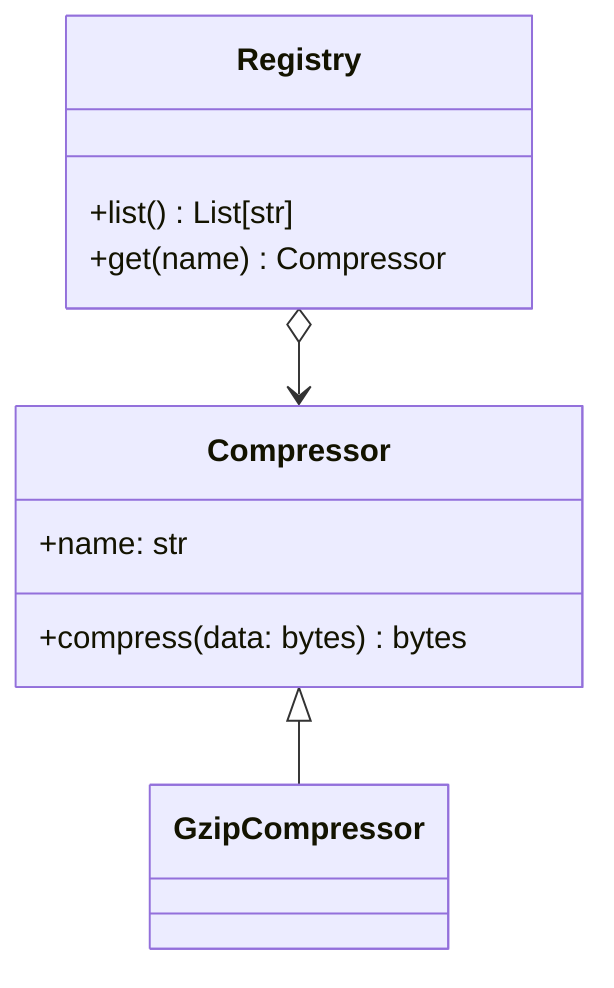

# ncdprime architecture

This document is a living sketch of how `ncdprime` is intended to work.

## Pipeline overview

```mermaid
flowchart LR
  A[Inputs\n(files/dirs/strings)] --> B[Dataset builder\n(normalize, label)]
  B --> C[Cell planner\n(1-D sequence / 2-D matrix)]
  C --> D[Compressor plugin\n(gzip/zstd/…)]
  D --> E[Compressed sizes\nC(x), C(y), C(xy)]
  E --> F[NCD\n(C(xy)-min(C(x),C(y)))/max(C(x),C(y))]
  F --> G[Outputs\nCSV/JSON + progress]

  C --> H[ETA estimator\nfit t=f(bytes) from early cells]
  H --> G
```

## ETA estimator (early timing fit)

Goal: provide a useful *time remaining* estimate while generating a long 1-D sequence or 2-D matrix.

Approach:
- Use the first ~6 completed cells as *timing samples*.
- Fit a smooth function `t = f(n_bytes)`.
- For each remaining cell, predict its compression time based on the uncompressed byte size and sum.
- Optionally refit around ~15 samples to improve the model.

Current implementation:
- fits both a linear model `t ≈ a + b·n` and a power-law `t ≈ k·n^p` (log-log fit)
- chooses the one with better R² (with a small margin to avoid overfitting)

## Compressor plugins

`ncdprime` is designed to support multiple compressors behind a stable interface.



## Coding principles

- Keep PRs small (<1000 LOC) and test-backed.
- Strict typing for core library code.
- Deterministic outputs where possible (for reproducible matrices).
